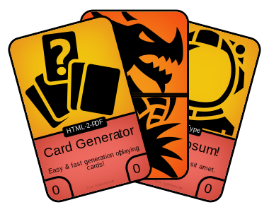

# HTML-Card Generator

This project allows the easy generation of playing cards for your own printing and playing. Cards can be generated based on JSON Data and the card design is achieved via HTML & CSS.

## Getting Started
You should be familiar with using the terminal to use this project and have [node.js](https://nodejs.org/) installed.
```bash
# Start off by cloning this repository or by downloading and unzipping it
git clone "https://github.com/jansim/html-card-generator.git"

# navigate into the repository
cd "html-card-generator"

# install all the needed packages
npm install
```

After you completed the above steps, you can start the generator

### Live Preview for editing
This command starts a local development server which displays your card's HTML in a web browser. This allows for faster previewing and iteration when changing the cards. Note however, that the browser preview is not 100% accurate and can differ from the actual cards in the PDF.
```
npm run serve
```
Note: There are a few features, which a modern browser supports, but which can not be copied over into the PDF. You should regularly generate a PDF for testing, just to make sure.

### Generate a pdf
This command creates the PDF with all the cards as single pages in a file called `cards.pdf`. All generated PDFs are found in the folder `pdf/`.
```bash
# Create cards.pdf
npm run build
```

### Generate a combined PDF for easy printing
This command creates a PDF with multiple cards per page. It expects a card size of 85mm x 54mm and creates a layout that fits onto typical business card template paper. This allows for easy seperation of the cards and saves a lot of manual cutting.
```bash
# Create cards.pdf
npm run build

# Create combined.pdf from the pages in cards.pdf
npm run combine
```
The `combine` command does NOT generate the `cards.pdf` itself. You should rather run both commands after each other as seen in the code example.

## Files & Folders
There are multiple files and folders in this project, many of which are usually uninteresting to someone just using the project.

### src/
The most important folder for generating your own cards. This folder contains the files which determine the contents and presentation of your cards.

#### index.html
This is the base for generating the cards, all other files in the folder are optional. It can be freely edited to suit your needs.

The default version of the `index.html` is quite complex, to allow for easier configuration via the passed in data.

The data passed into the `index.html` is rendered via [handlebars](http://handlebarsjs.com/) see the linked handlebars website for more information.

#### layout / style / *.css
The CSS files in the `src/` folder configure the visual display of the cards and can be used to style them to your needs. You can freely add or remove styles.

#### data.json
This file contains the data passed into the `index.html` in JSON format. In its default form it contains a `cards` array with objects inside corresponding to the cards being rendered.

You can add or remove fields in the `data.json` and freely edit the file, as long as its valid JSON and the data matches the `index.html`.

#### options.json
This file configures the rendering of the HTML to the PDF. Its options are passed onto the `html-pdf` package. For more information on the package and its supported options see the package's [website](https://github.com/marcbachmann/node-html-pdf/).

## Icons
The icons in this project are made by multiple authors and were obtained from https://game-icons.net. They are licensed under CC BY 3.0. See the license in `src/game-icons/license.txt` for more details.

They are also included as an icon-font made by [seiyria](https://github.com/seiyria/gameicons-font).
